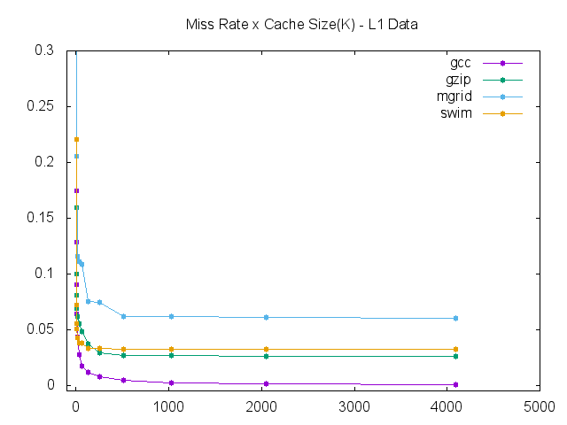
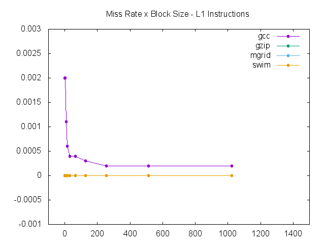

#Exercício 2
| NOME | RA |
|:-:|:------:|
| Renan Camargo de Castro | 147775 |

##Introdução
Para analisar o desempenho dos caches, foi utilizado uma versão do DineroIV modificada para ler traces SBC. Além disso, utilizamos os traces, propriamente ditos, como dumps de alguns programas, como gcc e gzip.

Para comparar, rodamos várias vezes, com várias configurações. Para cada parâmetro, variamos até encontrar a melhor configuração naquele parâmetro. Dada a melhor configuração, variamos o próximo, e assim por diante.
## Procedimento
Para analisar o resultado, utilizamos o script "run_script.sh" contido no repositório. Foram feitas tentativas de rodar o dinero com Python, mas não foram bem sucedidas.
O script é simples, varia os parâmetros do cache de dados e de instruções em um for, para potências de dois. Redireciona a saída formatada do dinero(somente a parte pertinente do miss-rate) dando append em um arquivo com o nome do programa testado.
Os comandos rodados são os seguintes:

~~~bash
     cd $location/${programs[$i]}
     dineroIV -informat s -trname ${names[$i]} -maxtrace 20 \
              -l1-isize ${j}K -l1-dsize ${k}K \
              -l1-ibsize $K \
              -l1-dbsize $L | grep "Demand miss rate" | \
              awk -F ' ' '{print $4}' | sed -n 1p | awk '{print "'"$j"'", $0}' \
              >> /Users/renancastro/Documents/Faculdade/1s2016/${names[$i]}_l1isize.data &

~~~
Grifo especial para a utilização em paralelo do programa, que acelerou(e muito) a execução de todos os dados gerados.

Foram usados 4 programas diferentes:

* gzip
* mgrid
* gcc
* swim

Em todos os casos foram utilizados os traces f2b. 
Como não foi possível executar o dineroIV através do ssh devido à um erro de não encontrar a GLIB_C mais recente, foi necessário compilar o dineroIV com os arquivos que adicionam as funcionalidades. Isso foi necessário, pois foi executado no mac e o binário foi compilado para linux.
Após isso, para facilitar a execução, foi montado o diretório home do ssh no mac através do utilitário:

~~~bash
sudo sshfs ra147775@ssh.students.ic.unicamp.br:/ /Users/renancastro/Documents/Faculdade/1s2016/teste -oauto_cache,reconnect,defer_permissions,negative_vncache,allow_other
~~~

##Parâmetros
Primeiro, variamos o tamanho dos caches L1 de instruções e L1 de dados.

Depois variamos o tamanho dos blocos e em seguida a associatividade dos caches.

Os resultados foram os **seguintes:**

Cache Size - Data             |  Cache Size - Instructions 
:-------------------------:|:-------------------------:
  |  

Block Size - Data             |  Block Size - Instructions
:-------------------------:|:-------------------------:
  |  

Cache Associativity - Data             |  Cache Associativity - Instructions
:-------------------------:|:-------------------------:
  |  

## Melhor configuração

A melhor configuração de um cache é aquela que proporciona uma taxa de miss menor, para o mínimo possível de tamanho.
Nesse caso, vemos também que as necessidades de cache/miss variam com o programa utilizados.

Nesse cenário, podemos inferir uma configuração sub-ótima, que tenta englobar todos os cenários testados. Mas ainda faltariam dados, como melhor simulação entre todos os possíveis parâmetros, pois existe uma relação entre eles. No caso, não foi possível testar devido à explosão combinacional e tempo limitado, mas para realmente prover a melhor configuração, seria necessário fazer esses testes.

Dos gráficos, podemos dizer que a melhor configuração se resume à:

* **Tamanho dos Caches**:
	* L1 - Instruções: **512K**
	* L1 - Dados: **1024K**
* **Tamanho dos Blocos**:
	* L1 - Instruções: **1024B**
	* L1 - Dados: **256B**
* **Associatividade**:
	* L1 - Instruções: **8**
	* L1 - Dados: **2**

	