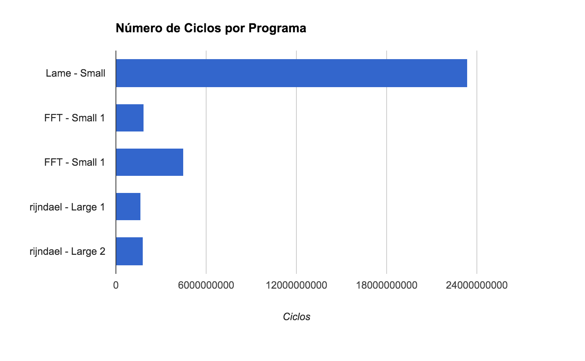

#Exercício 3
| NOME | RA |
|:-:|:------:|
| Renan Camargo de Castro | 147775 |

##Introdução
Nesse exercício, iremos analisar e utilizar um simulador do mips feito com archc/systemc para contar os CPIs.
Após montado toda a estrutura, usamos o simulador do mips para realizar  algumas experiências.

##Hello World
Para testar a execução e ver o funcionamento, foi feito o programa mais simples em C e compilado com o gcc do arm, foi rodado no mips.x, que é o simulador.
Os resultados foram os seguintes:

~~~bash
-bash-4.3$ ./mips.x --load=hello_world.mips

        SystemC 2.3.1-Accellera --- Apr  8 2016 08:47:14
        Copyright (c) 1996-2014 by all Contributors,
        ALL RIGHTS RESERVED
ArchC: Reading ELF application file: hello_world.mips
ArchC: -------------------- Starting Simulation --------------------

Hello World
ArchC: -------------------- Simulation Finished --------------------

Info: /OSCI/SystemC: Simulation stopped by user.
ArchC: Simulation statistics
    Times: 0.00 user, 0.00 system, 0.00 real
    Number of instructions executed: 2726
    Simulation speed: (too fast to be precise)

~~~

Após isso, para entender melhor o funcionamento e analisar a quantidade de instruções de ADD, fiz as seguintes alterações nos arquivos do simulador:

~~~diff
43c43
< int add_instr_counter = 0;
---
>
74c74,75
<   add_instr_counter = 0;
---
>
>
81,82d81
<   dbg_printf("quntidade de adds: %#x",add_instr_counter);
<   cerr << "quantidade de adds " << add_instr_counter << endl;
310d308
<   add_instr_counter++;
~~~

Executando o compilador modificado, buscando intruções add:

~~~bash
-bash-4.3$ mips-newlib-elf-objdump -d hello_world.mips | grep ' add '
-bash-4.3$ ./mips.x --load=hello_world.mips

        SystemC 2.3.1-Accellera --- Apr  8 2016 08:47:14
        Copyright (c) 1996-2014 by all Contributors,
        ALL RIGHTS RESERVED
ArchC: Reading ELF application file: hello_world.mips
ArchC: -------------------- Starting Simulation --------------------

Hello World
ArchC: -------------------- Simulation Finished --------------------
quantidade de adds 0

Info: /OSCI/SystemC: Simulation stopped by user.
ArchC: Simulation statistics
    Times: 0.00 user, 0.00 system, 0.00 real
    Number of instructions executed: 2726
    Simulation speed: (too fast to be precise)

~~~

Nesse caso, podemos ver que não existem instruções de add, só são utilizadas instruções ADDU (conferido com o objdump).

Isso se deve, principalmente, ao modo que a linguagem C trata o overflow. Ela não identifica se houve overflow, apenas deixa o número estourar e voltar ao negativo.
Por esse motivo, e ainda, como a diferença entre add e addu é somente a identificação do overflow e a setagem dos bits de overflow, o GCC utiliza, na compilação, a instrução de ADDU(já que pela definição, a linguagem C não precisa usar add).

A operação bitwise de adição é a mesma para signed e unsigned.

##Avaliando o desempenho
Após isso, foi regerado o simulador do MIPS com a flag -s, para que imprimisse as estatísticas das instruções.
Também rodei os seguintes programas:

* **lame**
* **fft**
* **rijndael coder**

Para obter as estatísticas de ciclos, precisamos classificar as instruções como sendo de:

* **Acesso à memória** - 10 CPI : lb, lbu, lh, lhu, lw, lwl, lwr, sb, sh, sw, swl, swr
* **Controle (branch/jump)** - 3 CPI: j, jal, jr, jalr, beq, bne, blez, bgtz, bltz, bgez, bltzal, bgezal
* **Outras** - 1 CPI

E somar, multiplicando cada instrução pelo seu número de aparições e "peso", para obter a quantidade de ciclos totais.

Para obter essas informações, rodamos os programas mencionados com a seguinte linha de comando, substituindo, logicamente, o programa hello_world pelo programa em questão:

~~~bash
./mips.x --load=hello_world.mips 2>&1 >/dev/null |  grep 'COUNT' | awk '{print $3}'
~~~
e foi colocado no google docs para poder analisar.

Ps: essa linha facilita na obtenção dos dados, pois já fornece tudo em uma coluna, podendo só colar no excel.

##Lame - Small
Exemplo de uma execução normal:

~~~bash
-bash-4.3$ ./mips.x --load=lame3.70/lame small.wav output_small.mp3

        SystemC 2.3.1-Accellera --- Apr  8 2016 08:47:14
        Copyright (c) 1996-2014 by all Contributors,
        ALL RIGHTS RESERVED
ArchC: Reading ELF application file: lame3.70/lame
ArchC: -------------------- Starting Simulation --------------------

LAME version 3.70 (www.sulaco.org/mp3)
GPSYCHO: GPL psycho-acoustic and noise shaping model version 0.77.
Encoding small.wav to output_small.mp3
Encoding as 22.1 kHz 64 kbps single-ch MPEG2 LayerIII ( 5.5x)  qval=5
    Frame          |  CPU/estimated  |  time/estimated | play/CPU |   ETA
]

   155/   155(100%)| 0:00:00/ 0:00:00|489335:28:00/492492:28:48|    0.0000|3157:00:48
ArchC: -------------------- Simulation Finished --------------------

Info: /OSCI/SystemC: Simulation stopped by user.
ArchC: Simulation statistics
    Times: 105.29 user, 0.01 system, 105.27 real
    Number of instructions executed: 6503845135
    Simulation speed: 61770.78 K instr/s
    ...
    ...
    ...
    
~~~

###Resultados
As instruções computadas e seus números estão na [seguinte tabela do google docs.] (https://docs.google.com/spreadsheets/d/1IgAyIb9RuEe49SyDdr0r7_q39E9Pi9GU53zsDwoLtXc/edit?usp=sharing)

A quantidade de ciclos necessárias para executar o programa foi de
**"23403697896 ciclos"**

##FFT - Small
A execução do FFT small foi composta pela duas partes a seguir:

1. **Parte 1** - ./mips.x --load=fft 4 4096 > output_small.txt
2. **Parte 2** - ./mips.x --load=fft 4 8192 -i > output_small.inv.txt

ps: para obter a quantidade das instruções, foi utilizado o comando anterior com grep e awk, mas não foi redirecionado a saída para o arquivo, pois isso não afeta o número final e simplifica o comando.

Exemplo:

~~~
        SystemC 2.3.1-Accellera --- Apr  8 2016 08:47:14
        Copyright (c) 1996-2014 by all Contributors,
        ALL RIGHTS RESERVED
ArchC: Reading ELF application file: fft
ArchC: -------------------- Starting Simulation --------------------

ArchC: -------------------- Simulation Finished --------------------

Info: /OSCI/SystemC: Simulation stopped by user.
ArchC: Simulation statistics
    Times: 20.34 user, 0.00 system, 20.35 real
    Number of instructions executed: 1293062633
    Simulation speed: 63572.40 K instr/s

[ArchC 2.1] Printing GLOBAL statistics from processor module mips:
     INSTRUCTIONS : 1293062438
     ....
     ....
     ....
~~~

###Resultados:

* Parte 1: **1878273331 ciclos**
* Parte 2: **4506387263 ciclos**

##Rijndael - Large
A execução do FFT small foi composta pela duas partes a seguir:

1. **Parte 1** - ./mips.x --load=rijndael input_large.asc output_large.enc e 1234567890abcdeffedcba09876543211234567890abcdeffedcba0987654321
2. **Parte 2** - ./mips.x --load=rijndael output_large.enc output_large.dec d 1234567890abcdeffedcba09876543211234567890abcdeffedcba0987654321

~~~
        SystemC 2.3.1-Accellera --- Apr  8 2016 08:47:14
        Copyright (c) 1996-2014 by all Contributors,
        ALL RIGHTS RESERVED
ArchC: Reading ELF application file: rijndael
ArchC: -------------------- Starting Simulation --------------------

ArchC: -------------------- Simulation Finished --------------------

Info: /OSCI/SystemC: Simulation stopped by user.
ArchC: Simulation statistics
    Times: 6.40 user, 0.01 system, 6.55 real
    Number of instructions executed: 483868971
    Simulation speed: 75604.53 K instr/s

[ArchC 2.1] Printing GLOBAL statistics from processor module mips:
     INSTRUCTIONS : 483862590
     SYSCALLS : 6381
~~~

###Resultados:

* Parte 1: **1647997346 ciclos**
* Parte 2: **1801580156 ciclos**

##Conclusão

Para os programas testados, fiz gráficos de distribuição de classes de instruções(dados, branch, outras) e disponibilizei no google docs.
Também fiz um gráfico comparativo dos programas em relação ao número de ciclos:

Podemos ver, claramente, que o LAME consumiu mais ciclos. Isso é possível ver na prática, pois a quantidade de ciclos é diretamente proporcional ao tempo de execução, logo, na prática, foi possível perceber que ele demorava mais tempo para executar.

##Referências

[Mips - Basic](http://fog.ccsf.edu/~gboyd/cs270/online/mipsI/mips_basics.html)

[Planilha - Com dados e gráficos](https://docs.google.com/spreadsheets/d/1IgAyIb9RuEe49SyDdr0r7_q39E9Pi9GU53zsDwoLtXc/edit?usp=sharing)